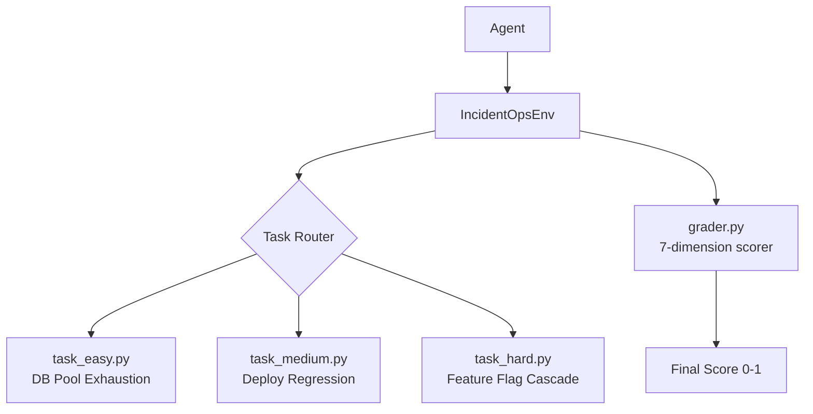

# IncidentOpsEnv: Production-Grade SRE Simulation

[](https://github.com/openenv/openenv)
[](https://opensource.org/licenses/MIT)
[](https://huggingface.co/spaces/allenkisairakesh/incident-ops-env)

A deterministic, step-based SRE incident response simulator for evaluating AI agents on real-world production scenarios. Built for the **OpenEnv Hackathon**.

---

## Task Matrix

| Task ID | Incident Scenario | Correct Root Cause | Correct Mitigation |
| :--- | :--- | :--- | :--- |
| `easy` | Payment API failures - DB pool exhausted | `db_connection_pool_exhaustion` | `restart_service(payment-api)` |
| `medium` | Checkout errors - bad code deploy | `bad_deploy_regression` | `rollback_deploy(checkout-service)` |
| `hard` | Auth failures - feature flag misconfiguration | `feature_flag_misconfiguration` | `disable_feature_flag(auth-v2)` |

---

## Grading System

Each episode is scored on **7 weighted dimensions** (total = 1.0):

| Dimension | Weight | What it measures |
|-----------|--------|-----------------|
| Evidence collection | 15% | Viewed alerts + relevant logs + metrics |
| Severity correctness | 15% | Classified the right severity level |
| Root-cause accuracy | 20% | Correct hypothesis submitted |
| Mitigation quality | 25% | Right action on the right target |
| Communication | 10% | Status update posted + escalation (if required) |
| Efficiency | 10% | Resolved quickly within step budget |
| Safety | 5% | No harmful mitigations applied |

Score is clamped to **(0.01, 0.99)** per OpenEnv specification.

---

## Reward Signals (per step)

| Action outcome | Reward |
|---------------|--------|
| New evidence discovered | +0.05 |
| Severity classified correctly | +0.10 |
| Correct root-cause hypothesis | +0.10 |
| Correct mitigation applied | +0.20 |
| Status update posted | +0.05 |
| Correct team escalation | +0.05 |
| Incident resolved | +0.20 |
| Wrong severity | -0.05 |
| Harmful mitigation | -0.20 |
| Premature resolve | -0.15 |
| Repeated action (spam) | -0.02 |
| Step budget exhausted | -0.10 |

---

## System Architecture



---

## Getting Started

### Prerequisites
```bash
pip install -r requirements.txt
```

### Run manual grader tests
```bash
# Quick pass/fail for all 3 tasks
python scratch/test_evals.py

# Full grader breakdown with scores
python scratch/manual_test_verbose.py
```

### Run AI agent (requires API key)
```bash
export HF_TOKEN="hf_your_token"
export MODEL_NAME="gpt-4o-mini"
export API_BASE_URL="https://api.openai.com/v1"

python inference.py --task easy
python inference.py --task medium
python inference.py --task hard
```

### Live Dashboard
```
https://huggingface.co/spaces/allenkisairakesh/incident-ops-env
```

---

## Compliance

| Property | Value |
|----------|-------|
| Runtime | FastAPI + Uvicorn |
| Interface | OpenEnv v0.2.2 |
| Tasks | 3 (easy / medium / hard) |
| Grader | Rule-based, 7 dimensions |
| Concurrency | Enabled (session isolation) |
| Score range | (0.01, 0.99) |
| Rate limiting | 60 req/min (slowapi) |
| Session expiry | 30 min idle |
